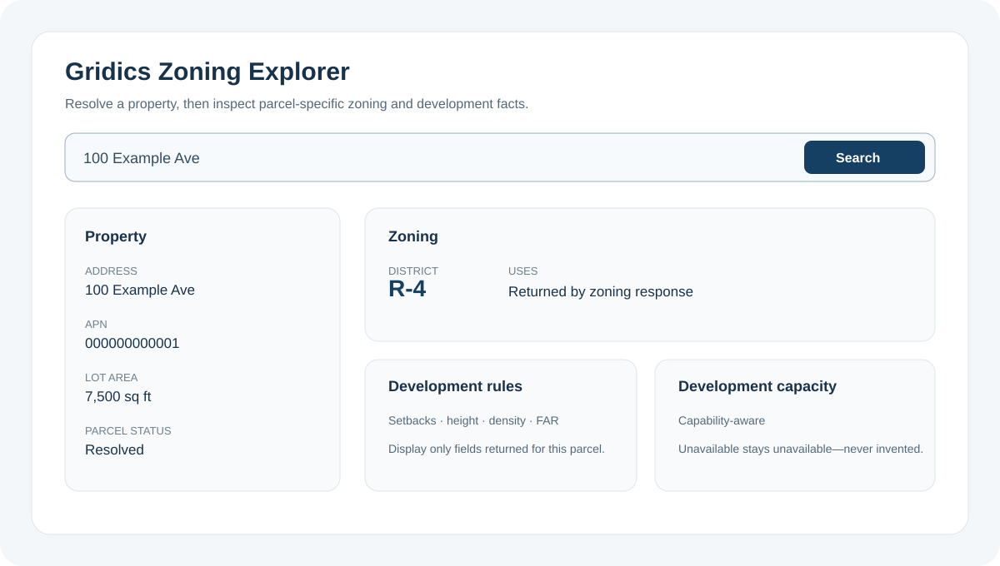

# Gridics Zoning API Cookbook

**Build zoning-aware real estate applications, property workflows, and AI agents with the Gridics Public API.**

Use Gridics to resolve properties, retrieve parcel-specific zoning, search and screen parcels, evaluate available development-capacity fields, enrich portfolios, support appraisal and due diligence, add address/APN search to applications, and connect property data to AI clients through Model Context Protocol (MCP).

[Create a Developer account](https://developer.gridics.com/get-started) · [Developer cookbook hub](https://developer.gridics.com/cookbook) · [Gridics Zoning Data API](https://gridics.com/zoning-data-api/) · [Browse the API contract](contracts/openapi-v2.json) · [Choose a use case](#build-with-gridics)

> **Verification status:** published as a preview cookbook. All seven language implementations pass credential-free fixture tests. End-to-end production acceptance and ordinary developer onboarding are still incomplete; examples are not guaranteed to work for every plan or geography. Location Search remains **preview** until suggest/retrieve/forward and the seven-language production matrix pass. Fixture success is not production verification.

## What can you build?

Gridics is designed for applications that need structured property and zoning intelligence rather than a generic property record alone.

- **Property zoning lookup** — resolve an address, APN, parcel ID, or coordinates and retrieve zoning for the canonical parcel.
- **Parcel and land-use search** — find properties with simple, advanced, or polygon-based filters.
- **Development opportunity screening** — discover released fields first, then use parcel and development-capacity fields where your plan and geography expose them.
- **Site selection** — create explainable property shortlists using supported parcel and zoning filters.
- **Portfolio enrichment** — add parcel, zoning, and property facts to existing property lists.
- **Appraisal and due diligence** — produce factual subject-property zoning summaries with provenance and explicit unknowns.
- **Location Search** — add address/APN suggest, retrieve, and forward search to an application.
- **AI and MCP** — expose bounded Gridics tools to AI applications and agent workflows without putting API keys in prompts.

## Build with Gridics

| I want to... | Start here |
|---|---|
| Get zoning for an address or APN | [Location Search](recipes/18-location-search/) → [Property lookup](recipes/03-property-lookup/) → [Zoning query](recipes/04-zoning-query/) |
| Build a property zoning lookup | [Property zoning guide](docs/guides/property-zoning-lookup.md) |
| Add address autocomplete to an app | [React Location Search](examples/react-location-search/) or [plain browser example](examples/browser-location-autocomplete/) |
| Show zoning and development information in a product UI | [Zoning Explorer](examples/react-zoning-explorer/) |
| Find development or redevelopment candidates | [Advanced search](recipes/08-advanced-search/) → [Polygon search](recipes/09-polygon-search/) → [Redevelopment screen](recipes/11-redevelopment-screen/) |
| Build a real-estate site-selection workflow | [Retail/site shortlist](recipes/12-retail-shortlist/) and [site-selection guide](docs/guides/real-estate-site-selection-api.md) |
| Enrich a portfolio | [Portfolio enrichment](recipes/10-portfolio-enrichment/) |
| Produce a property/zoning factsheet | [Property factsheet](recipes/13-property-factsheet/) |
| Detect changes in customer-managed property snapshots | [Snapshot diff](recipes/14-snapshot-diff/) |
| Build a property due-diligence workflow | [Due diligence](recipes/15-due-diligence/) |
| Add zoning to appraisal software | [Appraiser zoning lookup](recipes/17-appraiser-zoning-lookup/) |
| Connect an AI client with MCP | [Gridics MCP integration guide](integrations/mcp/) |
| Build an AI zoning assistant | [AI zoning assistant guide](docs/guides/ai-zoning-assistant.md) |

The [complete recipe index](docs/recipes.md) includes difficulty, endpoints, required capabilities, and implementation status.

## Get an API key

### 1. Create a Developer account

Open the [Gridics Developer Portal](https://developer.gridics.com/get-started), create or join an Organization, choose the geography and plan appropriate for your use case, and create an API key under **Workspace → API Keys**.

Your Organization owns its API keys, subscriptions, geography access, and usage. The Developer Portal is authoritative for current plans, quotas, pricing, field availability, and product access.

### 2. Configure the cookbook

~~~bash
git clone https://github.com/gridics/zoning-api-cookbook.git
cd zoning-api-cookbook
cp .env.example .env
~~~

Edit `.env` to set `GRIDICS_API_KEY` and then load the variables into your shell before running a live recipe:

~~~bash
set -a
source .env
set +a
~~~

Never commit a secret key, embed it in browser code, place it in a URL, or paste it into an AI prompt.

### 3. Verify your key

~~~bash
curl --fail-with-body \
  --header "x-api-key: ${GRIDICS_API_KEY}" \
  "${GRIDICS_API_BASE_URL:-https://api.gridics.com}/v2/me"
~~~

Or run the first Python recipe:

~~~bash
cd recipes/01-hello-world/python
python3 main.py
~~~

### 4. Discover your available geography

Run [recipe 02](recipes/02-discover-counties/) to distinguish Gridics coverage from the counties your Organization is entitled to query.

### 5. Solve a real problem

For zoning-by-address, continue with [recipe 18](recipes/18-location-search/) for free-form resolution, then [recipe 04](recipes/04-zoning-query/) for zoning. For development/site-selection workflows, start with [recipe 08](recipes/08-advanced-search/).

## Why Gridics for zoning-aware applications?

Many real-estate APIs stop at parcel and assessor facts. Gridics combines property resolution with parcel-specific zoning data and exposes richer development-related fields where they are released for the caller's plan and geography.

The cookbook demonstrates how to work with those capabilities safely:

- discover fields and capabilities before relying on them;
- preserve unknown, unavailable, unsupported, and not-entitled states;
- keep canonical Market, Place, parcel, and APN identifiers intact;
- retain request/provenance information for professional workflows;
- bound pagination, retries, usage, and result counts;
- keep server credentials out of browsers and AI tool arguments.

See the [Zoning API guide](docs/guides/zoning-api.md), [development capacity guide](docs/guides/development-capacity-api.md), and [parcel zoning data guide](docs/guides/parcel-zoning-data.md).

## Recipes

| Stage | Recipes | What you learn |
|---|---|---|
| First request | [01](recipes/01-hello-world/), [02](recipes/02-discover-counties/) | Verify a key, understand coverage vs entitlement, and select canonical Market/Place IDs. |
| Property + zoning | [03](recipes/03-property-lookup/), [04](recipes/04-zoning-query/), [18](recipes/18-location-search/) | Resolve a property and retrieve parcel-specific zoning. |
| Search | [05](recipes/05-simple-search/)–[09](recipes/09-polygon-search/) | Search, paginate, handle errors, discover fields, and search polygons. |
| Business workflows | [10](recipes/10-portfolio-enrichment/)–[15](recipes/15-due-diligence/), [17](recipes/17-appraiser-zoning-lookup/) | Portfolio, redevelopment, site selection, factsheets, change detection, due diligence, and appraisal. |
| AI integrations | [16](recipes/16-mcp-tools/) | Build a bounded MCP-compatible tool surface over Gridics data. |

Every recipe has equivalent implementations in Python, Node.js JavaScript, TypeScript, PHP, C#/.NET, Java, and Go. Basic HTTP operations also include cURL examples.

## Featured example: Zoning Explorer

[examples/react-zoning-explorer](examples/react-zoning-explorer/) is the showcase UI for composing a property-search experience with a zoning/development panel. It runs with synthetic fixtures by default and deliberately requires a server-side zoning adapter for live zoning calls so secret API keys never enter browser JavaScript.

## MCP and AI agents

Gridics Public API MCP uses the canonical **/mcp** connection exposed by the deployment and the Developer Portal's MCP Connections experience. Use the [MCP integration guide](integrations/mcp/) for architecture, client connection guidance, and safe tool design.

For AI applications, prefer bounded typed tools over pasting zoning documents or credentials into prompts. Resolve a canonical property first, call Gridics tools, preserve references and unknowns, and let the model explain returned facts rather than invent missing zoning values.

## Search and technical guides

These guides are intentionally useful standalone entry points for developers evaluating zoning and property-data solutions:

- [Zoning API](docs/guides/zoning-api.md)
- [Parcel zoning data](docs/guides/parcel-zoning-data.md)
- [Property zoning lookup](docs/guides/property-zoning-lookup.md)
- [Allowed uses and zoning rules](docs/guides/zoning-allowed-uses-api.md)
- [Development capacity](docs/guides/development-capacity-api.md)
- [Real-estate site selection](docs/guides/real-estate-site-selection-api.md)
- [Property due diligence](docs/guides/property-due-diligence-api.md)
- [Appraisal zoning data](docs/guides/appraisal-zoning-api.md)
- [Zoning MCP server](docs/guides/zoning-mcp-server.md)
- [AI zoning assistant](docs/guides/ai-zoning-assistant.md)

## Language support

| Language | Runtime |
|---|---|
| Python | 3.11+ |
| Node.js JavaScript | 20+ |
| TypeScript | TypeScript 5 / Node.js 20+ |
| PHP | 8.2+ |
| C#/.NET | .NET 8+ |
| Java | 21+ |
| Go | 1.22+ |

The language runners share one reviewed recipe manifest but remain native implementations. CI checks all recipe entry points, request parity, secret redaction, fixture behavior, the browser examples, and the React examples.

## Common configuration

| Variable | Required | Meaning |
|---|---:|---|
| GRIDICS_API_KEY | Yes for live server calls | Organization secret API key. Never expose it in a browser or AI prompt. |
| GRIDICS_API_BASE_URL | No | Defaults to https://api.gridics.com. |
| GRIDICS_MARKET_ID | Market-scoped recipes | Canonical ID returned by /v2/markets. |
| GRIDICS_PLACE_ID | County/Place-scoped recipes | Canonical entitled Place ID. |
| GRIDICS_PARCEL_ID | Zoning recipes | Canonical parcel/group identifier. |
| GRIDICS_DRY_RUN | No | Set to 1 to inspect redacted request plans. |
| GRIDICS_FIXTURE_MODE | Tests only | Synthetic local fixture mode. |

The values in [.env.example](.env.example) are synthetic and will not work against production.

## Test without an API key

~~~bash
python3 tests/validate_repository.py
python3 tests/run_fixture_smoke.py --language python
python3 tests/run_fixture_smoke.py --language nodejs
python3 tests/run_fixture_smoke.py --language go
~~~

Fixture tests make no live or billable requests. Protected live verification is a separate bounded workflow; fixture success is never reported as production verification.

## Data and professional boundaries

Gridics returns factual data according to the caller's active capabilities and geography. A cookbook example is not a legal zoning determination, formal appraisal, title opinion, credit decision, availability claim, or assurance of permit approval. Missing values remain missing; null is not zero.

See [request conventions](docs/request-reference.md), [compatibility notes](docs/compatibility.md), [security guidance](SECURITY.md), and [support](SUPPORT.md).

## Contributing

Contributions are welcome when they use only public Gridics interfaces, public dependencies, and synthetic or explicitly approved examples. Read [CONTRIBUTING.md](CONTRIBUTING.md) and [AGENTS.md](AGENTS.md) first.

Licensed under the [Apache License 2.0](LICENSE).
